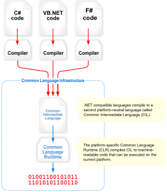
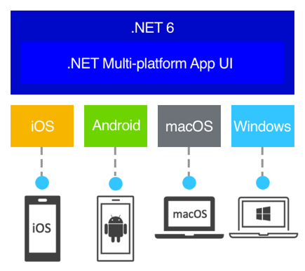
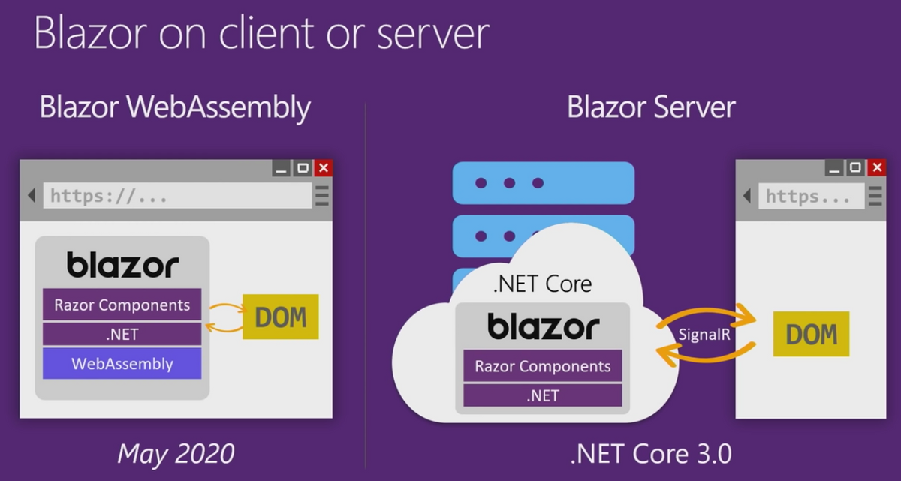

# A little introduction

## Overview
Welcome to this C# bundle ! Despite the name, this is not a C# language focused workshop.
*(Yes I know, but before you kill me, let me explain what I mean)*

I don't think you can get all of a language syntax and quirks in a single one-day session. Properly learning a language (especially a complex one such as C#) is a long process involving a lot of try and retry, demo projects, PoC etc..

So, our goal for today is to simply get an "overview" of the Microsoft and .NET ecosystem. To do so, we'll start by:
- (*Optional*) Make a small C# console application to get used to the syntax
- Making a C# .NET Core Library for QR Code generation,
you'll either code the logic yourself or use a NuGet package.
- Use this library inside a .NET MAUI application and test it on most platforms.
- Use the same library inside a .NET Blazor webapp, that will expose a REST API allowing users to create QR codes using a simple GET request
- Deploy this webapp on Azure

## Technologies

During the overview, I talked about many different frameworks and languages, so let me give you the boring history part

- C\# : Is an Object Oriented, strongly typed language. It's really similar to Java in some aspects (only the best features, don't worry, the rest has been thrown away as it should)

- .NET Framework (Used to be name .Net CORE) : The main Microsoft software framework.  It is open source (MIT License) and cross platform

- CLR : Serves as the execution engine of .NET Framework and offers many services such as memory management, type safety, exception handling, garbage collection, security and thread management. All programs written for .NET Framework are executed by the CLR

- .NET MAUI : The evolution of Xamarin, which allows programmers to deploy (using a single codebase) to IOS, Android, macOS and Windows (Linux is not really supported for many reasons, mainly because Microsoft target for MAUI is for "business apps" so end user focused apps, and Linux is not widely used by regular consumers)

- .NET Blazor : A framework for building interactive client-side web UI with .NET, it has two "versions", Blazor Server, and Blazor WASM.

As you can see, one of the main advantage of working with this software stack, is that you can share a lot of code and resources between them because they run on the same logic and framework (.NET). This is thanks to the fact that Microsoft has a lot of money and manpower to throw into all of these technologies at once, aswell as making them work together.

# The interesting part

Head over to the next chapter now.

