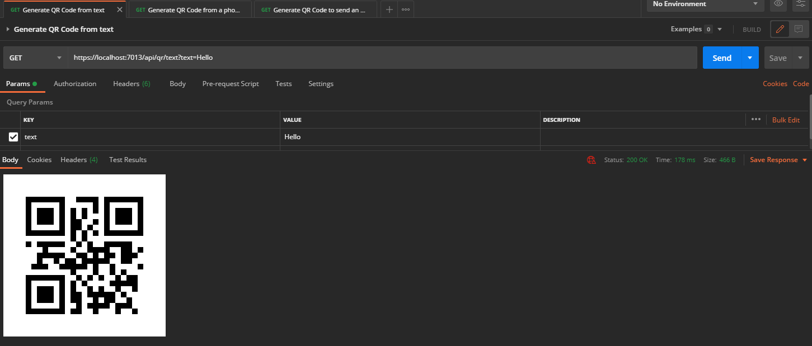

# Using this library in a .NET Blazor server

Now, wouldn't it be nice if we could generate these QRs by simply making a request to an API ? If you look in this repository you'll find a file in the postman folder containing a collection of postman requests. Your job is to deploy a .NET Blazor server hosting an API that can respond to these requests by generating a QR Code using your own library (QrLib).

## Create a .NET Blazor Server project

Let's start by adding a .NET Blazor server project to our solution and referencing QrLib.
It is the same process as the .NET MAUI App we created before, just right click on the solution in the solution explorer and add a Blazor Server project
Name it: **QrGeneratorAPI**
.NET Blazor can be used to render user interface as well as routing (and many other things) but we'll focus on routing and handling API requests.

## Adding a dependency to a local .NET Library

Now we want to use QrLib in that project,
since QrLib is in the same "Solution" (Bundle of projects), we don't need NuGet.
Instead, deploy **QrGeneratorAPI** in the solution explorer panel and right click the **Dependencies** tab, from there click **Add project reference** and select **QrLib**, finish by pressing Ok.

You are now able to use any public function exported by QrLib inside your project, you don't have to worry about any platform, everything is taken care of by the .NET Framework.

## Adding QrGenerator as a singleton service

Blazor Server provides a dependency injection logic, meaning you can register services / resources instances and access them from different parts of the code, whether it is in a controller or in a page.

Let's register our generator as a service, to do so, head over to **Program.cs**
You'll notice a variable called builder, add a new line before
```C#
builder.Services.AddRazorPages();
```
and type in this code
```C#
builder.Services.AddSingleton<IQrGenerator>(new QrGenerator());
```
you might have to add a using statement as such:
```C#
using QrLib;
```
If you get an error saying QrLib does not exist, you didn't add a dependency to QrLib, refer to the previous section.
This lines tells Blazor to create an instance of QrGenerator that implements the interface IQrGenerator as a singleton and make it available for anyone asking.
*Singleton* is the service lifetime, here are all of the available lifetimes:
- Transient operations are always different, a new instance is created with every retrieval of the service.
- Scoped operations change only with a new scope, but are the same instance within a scope.
- Singleton operations are always the same, a new instance is only created once.

## Adding a controller

Create a **Controllers** folder in the solution, right click on it, and add a **Controller** file, choose **API > Empty API Controller** and name it *QrController.cs*
The created file should have this structure:
```C#
using Microsoft.AspNetCore.Http;
using Microsoft.AspNetCore.Mvc;

namespace QrGeneratorAPI.Controllers
{
    [Route("api/[controller]")]
    [ApiController]
    public class QrController : ControllerBase
    {
    }
}
```

Remove the Route attribute as we won't need a global one

## Injecting a service into a controller

Let's get our QrGenerator injected into our controller, to do so, start by adding a **IQrGenerator** variable to your class as private and add a constructor to your class like so:
```C#
using Microsoft.AspNetCore.Http;
using Microsoft.AspNetCore.Mvc;

namespace QrGeneratorAPI.Controllers
{
    private IQrGenerator QrGenerator { get; set; }

    public QrController(IQrGenerator qrGenerator)
    {
        if (qrGenerator == null)
            throw new ArgumentNullException(nameof(qrGenerator));
        this.QrGenerator = qrGenerator;
    }
}
```
Blazor DI will take care of injecting the service as a parameter to your constructor when constructing the instance, you don't have anything particular to do.

## Adding routes handler to your controller

Now, let's get some routes in our controller shall we;
we're going to need three routes:
- A route to generate a Qr Code from text
- A route to generate a Qr Code from a phone number
- A route to generate a Qr Code from an email structure

If you did not implement all of these functions in your library, you can go back and do it, if you don't want to, just don't implement the routes for them.
Adding a route handler is really easy, all you have to do is create a function, add the parameters you want aswell as how to get them (Exemple: From the body, from json, from the query URL...), add the HTTP method to handle, and a return type!
I'll make the first one for you, so you can reuse the code for your own routes

```C#
[HttpGet] // We handle HTTP Get requests ...
[Route("api/qr/text")] // ... on https://domain.com/api/qr/text
public IActionResult GetText([FromQuery(Name = "text")] string text) // We need a parameter named text that will be taken from the query URL ?name=
{
    return Ok("Everything went fine"); // We return a 200 with a message
}
```

Now that you have your routes setup, let's make them do useful things, but I'm not going to help you for this one, I'll just guide you a bit.

Your code will need to do these things:
- Call QrGenerator.From*Method* and get the byte data
- return a file using File() with *image/png* as the MIME type.

### Tasks:
- [ ] Add a route handler for Qr Text generation
- [ ] Add a route handler for Qr Phone generation
- [ ] Add a route handler for Qr Mail generation

## Expose these routes

You're almost done, we have to tell Blazor to expose our controller along with the routes, head back over to **Program.cs**,
from there, add this code:

```C#
app.MapFallbackToPage("/_Host");

// Add this here
app.UseEndpoints((endpoints) =>
{
    endpoints.MapControllers();
});
//

app.Run();
```

This simply tells Blazor how to behave with our controller and how to expose it.

## Test with Postman

You're all set! Go ahead and open the collection in Postman and try some requests, you will probably have to change the URLs to match your controller routes.

If you succedeed, you should see your QR codes directly in postman like so:


## Deploying on Azure

Congratulations ! Let's now see how easy it is to deploy it on azure
This won't cost you any money as you technically have a student azure account, check out the advantages of being a student (https://azure.microsoft.com/en-us/free/students/).

If you went this far, you can go ahead and deploy this on azure, all you have to do is right click on your .NET Blazor server project in the solution explorer > Click **Publish**, you'll have multiple options here, deploying on a docker container, to an FTP server etc., chose Azure and follow the instructions !
