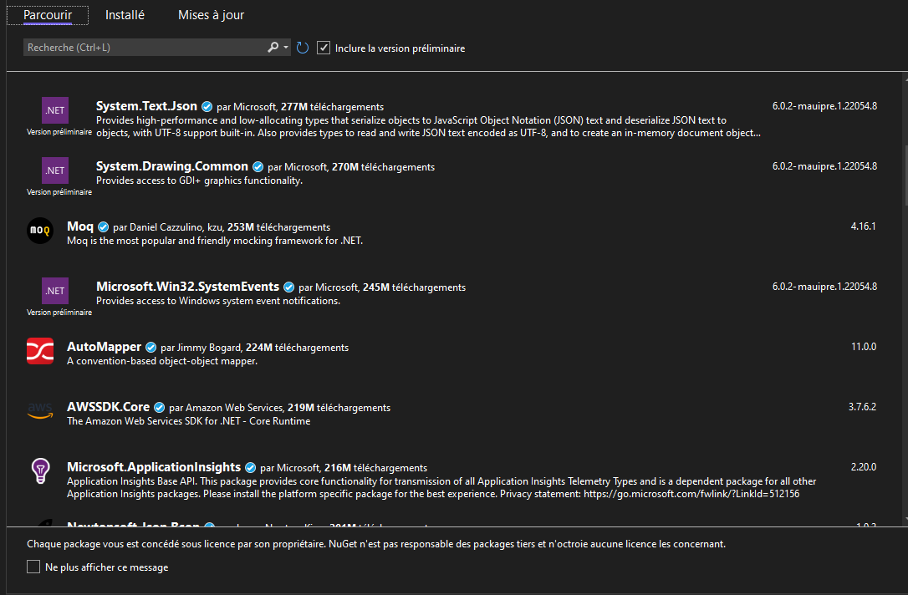

# Creating a .NET Library (QrLib)

Now, let's get down to the actual business.

Start by opening the solution provided in QrCodeGenerator solution (You just have to click on the .sln file, or open it in Visual Studio 2022)

Your first (or second) task of the day, is to make a Qr code generation library.
You have been provided with an interface file describing the functions you will have to implement.

If you have the time and knowledge, feel free to make it from scratch, you can start by reading the ISO Specification here ([ISO Standard for QR code](https://www.swisseduc.ch/informatik/theoretische_informatik/qr_codes/docs/qr_standard.pdf)). You can then skip the next section

### NuGet
However if you don't (it's fine, we're here to learn) get ready to meet one of your best friends from now on, the mighty .NET package manager, NuGet!

Here's how you can summon the NuGet god:

*Right click on your project (you'll find it on the right of your screen) > Manage NuGet packages*

You'll see this page:



This package manager contains thousands of packages authored by many different people, ranging from big companies such as Amazon to independent developers, even you can publish to NuGet.

NuGet takes care of versioning but also the platform of the library so that it only shows compatible libraries for your project.

Once you download a package, it will be added as a reference and you can access it in your code simply like this:

```C#
using SuperPackage;
```

Now, we need a QR Code generation package, feel free to use any that pleases you. My recommandation (and what I used personally) is QRCoder (documentation for it is available here: [QrCoder documentation](https://github.com/codebude/QRCoder))

Search for QrCoder in NuGet and just press install, that's it, you're all good to go!

From now on, you're on your own ! Using Google, the documentation for the library you chose and the links I'll provide in a separate section TODO Link it here lmao, you should be able to implement the functions from IQrGenerator.cs in QrGenerator.cs .

To help you a bit, I created a test project that uses your library so you can test the functions you code (QrLibTester)

If you can't do all functions and tried your hardest, it's okay, but try to at least get FromText working.

This may seem hard at first, especially if this is the first time you touch C# but trust me it's not that bad, feel free to ask for help if you're stuck.

### Tasks:
- [ ] (*Optional*) Include using NuGet, a library such as QrCoder that takes care of generating an image of a QR Code
- [ ] Create a class that implements the IQrGenerator interface
- [ ] Implement FromText()
- [ ] Implement FromPhone()
- [ ] Implement FromMail()
